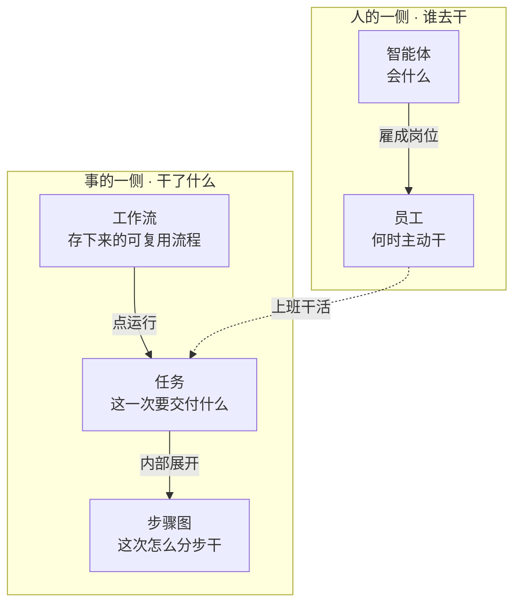

# QAgent 产品手册

> 本手册讲三件事：**这个产品是什么、里面那些名词都是什么意思、什么场景该用哪个功能。**
> 内容依据项目自带的用户文档与运行中的实际系统核对整理。
>
> **用词约定：本手册一律以「界面实际标签」为准。** 产品文档里的某些用词和界面对不上（比如文档写「应用中心」，界面写「工作流」），本手册统一采用界面说法，需要时注明数据层的叫法。

---

## 一、这是个什么产品

### 一句话

**QAgent 是一个让 AI 把事做完的桌面 / Web 工作台。**

它不止是聊天。它能规划、能执行、能让你盯着进度、能定时上班值班、能把跑通的流程存下来反复用，还能接到飞书等 IM 里干活。

### 和普通 AI 聊天的区别

| | 普通 AI 聊天 | QAgent |
|---|---|---|
| 干什么 | 回答你的问题 | **把事做完** |
| 过程 | 一问一答 | 自动拆成步骤，进度可视化 |
| 时间跨度 | 一次对话 | 能跑几小时到几天，能定时自动开工 |
| 角色 | 一个助手 | 多个角色，各有岗位职责 |
| 结果 | 聊天记录 | **任务账本 + 产出文件，可验收可打回** |

### 特别适合

1. **个人固定业务** —— 一套多步流程固定下来，以后只换参数反复跑。
2. **组织协作** —— 多个 AI 员工并行干活，关键环节你来审批 / 验收。

**适合**：多步、要结果、要过程可追踪、断了能接着来的事。
**不太适合**：只想随口问一句就走的轻量问答（也能聊，但那不是它的主战场）。

### 给谁用

| 人群 | 典型身份 | 主要痛点 | 最该用 |
|---|---|---|---|
| 研发与构建者 | 独立开发者、全栈、技术负责人 | 从需求到能跑的东西链路太长，怕上下文丢、怕盯屏 | Plan、项目团队、工作空间、任务中心 |
| 知识工作者 | 研究、分析、咨询、学生 | 检索—归纳—成稿容易断，怕内容堆砌 | 聊天 + 知识库、记忆、技能 |
| 内容与运营 | 文案、运营、自媒体 | 环节多、工具杂、同类稿反复出 | 工作流、自动化、技能 |
| 业务与综合岗 | 运营、项目、行政 | 日报汇总、整理资料，习惯在 IM 里办事 | 自动化、目标、飞书渠道 |
| 团队赋能者 | 创始人、数字化接口人 | 要给同事开箱即用的角色，又要可控可观测 | 智能体、员工、任务中心 |

---

## 二、六个核心概念（先搞懂这些，后面都顺）

混乱基本都来自把「人」和「事」混在一起谈。先分成两侧：



### 1. 智能体 —— 会什么

一个角色配置：**人设 + 模型 + 工具 + 技能**。

- **人设**：职业身份、说话风格、价值观、决策偏好。
- **工具**：它能做的操作，比如读写文件、搜索、跑命令。
- **技能**：能力包（内置 50+ 个，覆盖文档、研究、媒体、开发流程）。

**关键特征：静态。你不叫它，它不动。**

> 例：建一个「Python 数据分析师」智能体 —— 人设写「偏好 Pandas，讨厌冗余循环」，勾上读写文件和终端工具，挂上数据分析技能，选好模型。它就是这么一个角色。

**界面位置**：侧栏「智能体」。

### 2. 员工 —— 何时主动干

**把一个智能体编成「岗位」，让它到点自己上班。**

岗位合同包含：职责、工作文件夹、上班频率、审批策略、汇报线。

**和智能体的区别就一句：智能体回答「会什么」，员工回答「什么时候主动干、对谁负责」。**

同一份能力，你可以只当聊天角色用，也可以雇成岗位让它值班 —— 这是两种身份，不是两个等级。

**界面位置**：侧栏「员工」。（产品文档里叫「智能体员工」，界面标签是「员工」。）

### 3. 任务 —— 这一次要交付什么

**一次具体交付的账本。** 有状态、有进度、能验收。

状态流转：

```
待开始 → 执行中 → 待闭环 → 已完成
                    ↘ 失败 / 已取消
```

- **待闭环**：这一岗已经交活了，但整单还要等下游或等你验收。
- 有下游的活干完不会立刻结束，会先挂成「待闭环」。

**界面位置**：侧栏「任务中心」。

### 4. 步骤图 —— 这次怎么分步干

**任务里面那张多步执行图。**

它不是你主动去创建的。当一件事够复杂（多个步骤、有先后），系统会自动把它拆成步骤、排好顺序，这张图就是步骤图。

**你在三个地方会看到它：**

1. 聊天切到 **Plan**，说一件多步的事 → 确认执行后，右侧弹出这张图
2. **任务中心**点开任意任务 → 里面那张图
3. 侧栏「**工作流**」里点开某条流程 → 它的画布就是这张图

**步骤之间会互相要东西**：后面的步骤缺数据，可以回头问前面的步骤要；同时顺序上还得互相等待（前面没完，后面不开工）。

**每个步骤自带**：指令、验收标准、重试次数（默认 3 次）、期望产出。

所以步骤图不是死的流程图 —— 某一步产出不合格，它会自己重试，而不是整条挂掉。

### 5. 工作流 —— 跑通的流程存下来反复用

**把跑通的多步流程存成「工作流」，以后填参数就能再跑。**

一条工作流有两个要素：

1. **参数** —— 每次跑要填的（比如「调研目标」「对比维度」）
2. **步骤链** —— 依次依赖的步骤，每一步指派一个智能体

**怎么用**：在侧栏「工作流」里新建 → 画布编排 → **发布** → 点「···」→「填参运行」。

> 例：第一次让 AI 做「竞品调研」，出结果后把它存成工作流，定义好参数。以后不用每次都从零说一遍 —— 选这条工作流、填参数、点运行就行。

**界面位置**：侧栏「工作流」。
**数据层叫法**：app（数据库里的 id 形如 `App_xxxx`）。**产品文档里写的「应用中心」「应用」，说的就是这里。**

> ⚠️ 别和侧栏「扩展应用」搞混 —— 那是装第三方扩展的地方，跟这里无关。

### 6. 自动化 —— 到点跑同一句

**到点跑固定指令**，适合日报、周报这类机械重复的事。

和员工的关键区别：自动化**没有岗位合同、没有看板、不会自己判断**，就是定时执行一句你写好的话。

和工作流的区别：自动化跑的是**一句话**，工作流跑的是一**条多步流程**。

**界面位置**：侧栏「更多」→「自动化」。

### 一句话记住六个

| 名词 | 一句话 | 生命周期 | 界面位置 |
|---|---|---|---|
| 智能体 | 会什么 | 长期 | 侧栏「智能体」 |
| 员工 | 何时主动干、对谁负责 | 长期 | 侧栏「员工」 |
| 任务 | 这一次要交付什么 | 一次性 | 侧栏「任务中心」 |
| 步骤图 | 这次怎么分步干 | 一次性 | 任务详情里看 |
| 工作流 | 跑通的流程存下来反复用 | 长期 | 侧栏「工作流」 |
| 自动化 | 到点跑同一句固定指令 | 长期 | 更多 →「自动化」 |

---

## 三、功能全貌（按侧栏逐个讲）

### 1. 聊天

主入口。输入框底部可以切换模式，模式决定 AI **怎么干**：

| 模式 | 干什么 | 特点 |
|---|---|---|
| **Ask** | 问问题、查资料、写文档 | AI 不主动动工具，专注回答 |
| **Agent** | 直接干活：写代码、跑命令、改文件 | 完整工具集，**默认模式** |
| **Plan** | 复杂多步任务 | **先出方案 → 你确认 → 再执行** |
| **Goal（目标）** | 交代下去就不管了 | **后台长跑**，自己规划、执行、自检、调整 |

> **Goal 的典型用法**：设个目标「每小时检查服务是否健康，连续异常 3 次就推飞书告警，跑 7 天自动停」，然后不用管它。

**别搞混**：Plan 是先对齐再开工；Goal 是长跑不用盯。

### 2. 任务中心

**所有任务的驾驶舱。** 不管任务从哪来的（对话 / 员工 / 工作流），都在这里看进度、处理、验收。

- 看板视图、任务详情、步骤图、任务总结
- 能暂停、恢复、终止、重跑
- **验收在这里做**：确认完成 / 打回重做

**它不是发起入口，是观测层。**

### 3. 工作流

**已跑通、以后只换参数反复跑**的流程库。

页面自己写的用法：

> **什么时候用？** 同一类活隔三差五就要干，流程已经固定，每次只是换换参数。
>
> **怎么用？** ① 点卡片进画布编排流程 → ② 发布 → ③ 点「···」→「填参运行」。

**适合**：报告生成（竞品分析、周报）、代码模板、数据处理、审查清单。

**别搞混**：实时聊天/Plan 是探索阶段，这里是流程已定型之后。

### 4. 自动化

**到点跑固定指令。**

配置：写清指令内容 → 选触发时刻 → 可选「完成后推送到飞书」。

**适合**：每天汇总进展、每周五出周报。

### 5. 员工

**岗位值班与协作。**

| 你会遇到的词 | 意思 |
|---|---|
| **自动上班（总开关）** | 开了之后，在岗员工按上班频率自动干活 |
| **上班频率** | 多久自动来一轮 |
| **工作项** | 员工岗位上的任务 |
| **待审批** | 等你处理的审批，常见是转交前要你点「同意派发」 |
| **同意派发** | 同意后**叫醒下一岗**继续干（不是普通同意） |
| **交工待验收** | 干完了等你确认结果（确认完成 / 打回） |
| **任务总结** | 交活时说明：做了什么、交付了什么、怎么验收 |
| **本轮工作汇报** | 一轮干完的小结 |
| **工作过程** | 这轮具体怎么干的，需要细节时才打开 |

**员工之间怎么协作（两条通道，别混）：**

- **正式交工**：结案时指定下游。**只能派给直属下级**，可能要你点「同意派发」。
- **叫醒 / 派发**：**任意在岗同事都能互相叫，包括同级的**。不用审批。

> 所以「同级能不能唤醒？」→ **能**。「同级能不能当正式交工下游？」→ **不能**，要改汇报线或由你改派。

**你什么时候要点按钮：**

| 情况 | 你的动作 |
|---|---|
| 员工交工，指定了下游，策略要求审批 | 点**同意派发**放行 |
| 员工交工，等你确认结果 | 点**确认完成**或**打回重做** |
| 员工指定了同级当下游 | 会失败 → 改汇报线、改用叫醒，或你改派 |

**人闸的重点在「交工后叫醒下一岗」，不是每条任务开工前都审一遍。** 新开的工作项默认可以直接跑。

### 6. 智能体

**角色的配置中心。** 三个 Tab：角色 / 技能 / 连接器。

在这里配人设、勾工具、挂技能、选模型。配好之后，可以只在聊天里用，也可以拿去雇成员工。

### 7. 资产中心

**AI「关于你」和「会干什么」的笔记本。**

| Tab | 内容 |
|---|---|
| 画像 | 你是谁、身份边界、人格说明 |
| 记忆 | 摘要、事实、过程记录 |
| 经验 / 专长 | 沉淀下来的本事，**可以晋升成技能** |
| 反思 | 按天的反思日志 |
| 统计 / 导出 | 哪些资产常用、哪些闲置；导出备份 |

**日常用法**：不用天天填表，在对话里说一句就行 ——

- 「记住我默认用 Python」→ 记成一条事实
- 「把这套排查方法沉淀成经验」→ 写成可复用的本事
- 「记一下今天的反思」→ 写进当天反思

### 8. 知识库 / 上传文档

**两个不同的东西，别混：**

- **知识库**：连接你在用的 Obsidian / 本地 Markdown 笔记文件夹，AI 能搜你的笔记。
- **上传文档**：把 PDF、Word 等上传，做成长期可检索的库。

### 9. 设置

7 个 Tab 管所有偏好，改动自动保存。

值得注意的一项 —— **工具审批策略**：

| 策略 | 效果 | 什么时候用 |
|---|---|---|
| 默认询问 | 高风险操作弹审批条，你点同意才执行 | 日常推荐 |
| 自动批准 | 全部直接执行不询问 | 个人本地、信任环境 |
| 仅会话内授权 | 同会话首次问，之后同名自动通过 | 长任务，省得反复点 |

可以对单个工具单独覆盖。比如要求终端每次都问、但删除操作自动批准。

### 10. 工作空间

**决定 AI 能碰什么。** 聊天底部可以绑定一个项目目录：

- 只聊天：AI 只回答问题，不碰文件
- 切到工作空间：AI 能读文件、改文件、跑命令

想让它动手改你的代码或文件，就得先进工作空间。

### 11. 预设角色与项目团队

- **预设角色**：面板自带的角色模板，可以直接复制成自己的智能体，不用从零写人设。
- **项目团队**：面向软件交付的多角色配置。软件类的多角色交付（规划 / 实现 / 验收）走「Plan + 项目团队」是推荐路径。

### 12. 资源包与资源市场

**一次装好「员工 + 工作流 + 技能」整套场景。**

想直接拿到一套能用的组合（比如某个行业的成套配置），用资源包。设置里的资源市场可以浏览和分享。

> 注意别和资产中心的「导出」混：**资源包 = 场景整包**（员工 + 工作流 + 扩展）；资产导出 = **只备份你的资产文件**。

### 13. 思维导图

**AI 边干活边维护的思路图。**

聊天看「它说了什么」，思维导图看「它在想什么、在追哪条线」。长任务跑偏的时候，打开它一眼能看出思路拐到哪去了。

### 14. 消息渠道与小Q

- **消息渠道**：飞书、微信、Telegram、Slack。可以直接在 IM 里对话、下目标、收结果；同一个渠道还能配多个账号。
- **小Q**：全局助手兼常驻管家。作用是**传讯、分诊、催办** —— 帮你把事派给对口的员工、汇总各岗卡住的活、催办交接。**它自己不下场干活**，具体实现永远交给对应岗位。

---

## 四、「我想干 X」→ 该用哪个

这张表是全书最实用的一页：

| 你的诉求 | 用这个 | 别误当成 |
|---|---|---|
| 跟 AI 聊清楚、试想法、改文件 | **实时聊天**（Ask / Agent） | — |
| 多步任务要先对齐方案再动手 | **Plan 模式** | 目标、自动化 |
| 软件类多角色交付（规划/实现/验收） | **Plan + 项目团队** | 员工（那是值班岗） |
| 要看板看进度、暂停/验收多任务 | **任务中心** | 聊天里的 Plan |
| 开放长任务、后台自己跑到边界 | **目标（Goal）** | 任务中心、自动化 |
| 每天/每周到点跑固定指令 | **自动化** | 员工、任务中心 |
| 流程已跑通，以后只换参数再跑 | **工作流** | 每次从零 Plan |
| 岗位定时上班、审批、写工作汇报 | **员工** | 自动化（没岗位合同、没看板） |
| 让 AI 记住你的偏好、过程与经验 | **资产中心**（对话里说「记住 / 沉淀 / 反思」） | 知识库、上传文档 |
| 本地 Obsidian / Markdown 笔记可搜 | **知识库** | 上传文档、资产中心 |
| PDF/Word 做成长期可检索库 | **上传文档** | 会话里拖文件 |
| 当前这一轮附带几个文件 | **会话文件上传** | 长期知识库 |
| 给角色配人设/工具/技能 | **智能体** | 员工（雇佣了才是岗位） |
| 在飞书里对话、收结果 | **消息渠道** | — |

---

## 五、三条典型路径

### 路径 A · 开发者：从需求到能跑的小功能

1. 配模型 → 绑定工作空间
2. 聊天底部切 **Plan**，用项目团队的提示词
3. 点「开始执行」→ 右侧看步骤图 / 任务中心看进度
4. 跑通后**存成工作流**，下次填参数直接跑

### 路径 B · 运营：每日汇总推飞书

1. 配模型 + 飞书渠道
2. 在**自动化**里写清指令、选每天时刻、打开推送
3. 点「运行」试一次 → 看历史 / 确认飞书收到

### 路径 C · 小团队：岗位盯仓库

1. 在**智能体**里准备好角色（或复制预设角色）
2. 在**员工**里雇佣、绑好工作目录、审批策略先选「谨慎型」
3. 开值班 → 处理待审批 → 收工作汇报
4. 交工后在**任务中心**看任务总结再验收
5. 临时需求用小Q 直接委派该员工，不用改职责

---

## 六、界面上在哪点

| 界面标签（按这个找） | 里面是什么 |
|---|---|
| **新建对话** | 聊天主界面（Ask / Agent / Plan / Goal） |
| **任务中心** | 所有任务的看板与验收 |
| **工作流** | 可复用流程的库（数据层是 `App_xxx`） |
| **智能体** | 角色、技能、连接器 |
| **员工** | 岗位、值班、审批、汇报 |
| 更多 → **自动化** | 到点跑固定指令 |
| 更多 → **知识库** | Obsidian / Markdown 笔记库 |
| 更多 → **资产中心** | 画像 / 记忆 / 经验 / 反思 |
| 更多 → **扩展应用** | ⚠️ 装第三方扩展，**和工作流库无关** |
| **设置** | 左下角齿轮 |
| **小Q** | 全局助手（委派、催办、飞书绑定） |

> ⚠️ **最容易踩的坑**：界面上的「**扩展应用**」不是工作流库。它装的是第三方扩展，和你的工作流是两回事。

---

## 七、最容易搞混的六组

| 组 | 一句话区分 |
|---|---|
| **工作流 vs 步骤图** | 工作流是**存起来的流程定义**（长期，在侧栏）；步骤图是**某次跑起来的图**（一次性，在任务里） |
| 智能体 vs 员工 | 智能体 = 会什么；员工 = 何时主动干、对谁负责 |
| 任务 vs 步骤图 | 任务是「这一件要干的事」；步骤图是「这件事怎么分步干」，藏在任务里 |
| 工作流 vs 自动化 | 工作流跑的是一条**多步流程**（要填参数）；自动化跑的是**一句话**（到点就发） |
| 员工 vs 自动化 | 员工有岗位合同、有看板、会自己判断；自动化只会照发 |
| 同意派发 vs 确认完成 | 同意派发 = 放行叫醒下一岗；确认完成 = 你验收结果。两道人闸 |
| 资产中心 vs 知识库 vs 上传文档 | 资产 = 关于你的偏好/经验/反思；知识库 = 你的笔记；上传文档 = 你上传的资料 |

---

## 八、设计上值得一提的几点

**审批是两道人闸，分工不同**

- **开工前不怎么审**：新工作项默认直接执行。
- **交工后审一次**：要叫醒下一岗时，按「岗位审批策略 × 这件事的风险」决定要不要你点同意。
- **最后你验收**：结果认不认，你说了算。

**步骤级自愈**

步骤图里的每一步都带验收标准和重试次数，某一步不合格会自己重试，不至于整条挂掉。失败的那一步也能单独重跑，不用整个从头来。

**资产会自己长**

对话告一段落后，系统会把你的偏好和可复用经验整理进资产中心，不需要你每次手动点。你只需要偶尔打开翻一翻、改改错字。

---

## 九、项目侧补充（技术相关，供参考）

| 项 | 说明 |
|---|---|
| 四层结构 | 界面 → 服务层 → Agent 运行时 → 框架内核 |
| 沙箱 | AI 跑命令的环境，支持本机 / 容器 / 集群三种隔离级别 |
| 外部工具接入 | 支持通过 MCP 协议接入外部服务（如 GitHub、Notion） |
| 消息渠道 | 飞书、微信、Telegram、Slack |
| 数据存放 | 本机数据目录 `~/.evoflow/`；主数据库 113 张表 |
| 命名说明 | 项目由开源项目 EvoFlow 分叉改造，内部标识符保留了 `evoflow`。**看到 `evoflow` 就是 QAgent 自己。** |
| 界面用词与文档不一致 | 界面「工作流」= 文档「应用中心」；界面「员工」= 文档「智能体员工」；界面「扩展应用」= 第三方扩展（`/extensions`） |
