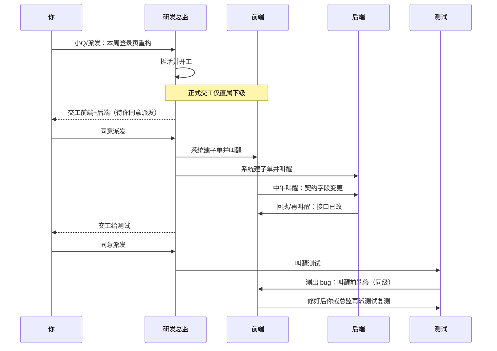

# 智能体员工：谁在用、组织怎么配、怎么协作

> **这篇单独讲「落地画像」**：什么人、什么行业、组织树长什么样、每岗是什么员工、一天里他们怎么互相叫醒/交工。覆盖研发运维，也覆盖教师、学生、白领、销售、电商、财务法务辅助、科研、医护行政、机关材料岗等。  
> 机制细则（状态、同意派发、两条通道）见 [智能体员工是什么](../explanation/smart-employees.md) [[explanation/smart-employees|智能体员工是什么]]；逐步点哪里见 [操作指南](../guides/configuration/smart-employees.md) [[guides/configuration/smart-employees|操作指南]] 与 [雇佣教程](../tutorials/hire-first-smart-employee.md) [[tutorials/hire-first-smart-employee|雇佣教程]]。

**读之前先记住两句：**

1. **正式交工**只能派给**直属下级**（你可改派）。  
2. **同级要对齐**用 **派发 / 小Q / 同事叫醒**，不要硬填同级当 handlers。

每个示例都按同一模板：**组织是什么 → 智能体员工是什么 → 怎么协作干活 → 你（人）干什么**。

---

## 目录

| 画像 | 适合谁 | 一句话 |
|------|--------|--------|
| [1. 一人公司 / 独立开发者](#1-一人公司--独立开发者) | 个人、副业 | 两岗盯盘 + 你当老板 |
| [2. 小团队软件研发](#2-小团队软件研发) | 3～8 人产研 | 总监交工 + 同级叫醒 |
| [3. 运维 / SRE 值班](#3-运维--sre-值班) | 平台、运维 | 运维值班写汇报，异常问人 |
| [4. 内容 + 运营工作室](#4-内容--运营工作室) | 新媒体、品牌小团队 | 周期值班 + 小Q 临时稿 |
| [5. 数据分析周报组](#5-数据分析周报组) | 业务分析、增长 | 取数岗 → 解读岗交工 |
| [6. 多客户外包工作室](#6-多客户外包工作室) | 接外包的小团队 | 一客户一盘或一岗 |
| [7. 知识库 / 文档中心](#7-知识库--文档中心) | 内训、Wiki 负责人 | 脏目录清单 |
| [8. 老板 + 技术搭档](#8-老板--技术搭档) | 非写代码的负责人 | 只看总结与同意派发 |
| [9. 教师 / 教研](#9-教师--教研) | 中小学、培训机构、高校教员 | 教研助理 → 练习稿交工 |
| [10. 学生 / 备考](#10-学生--备考) | 大学生、考研考公、自学 | 学习助理 + 笔记整理 |
| [11. 办公室白领](#11-办公室白领行政人事综合) | 行政、人事、总裁办 | 会务/制度/台账专员 |
| [12. 销售与客户成功](#12-销售与客户成功) | 销售、CS、渠道 | 跟进清单 + 纪要草稿 |
| [13. 电商店主 / 个体户](#13-电商店主--个体户) | 淘宝/抖店/门店老板 | 店铺运营助理 |
| [14. 财务会计（辅助）](#14-财务会计辅助) | 出纳、会计助理 | 单据目录与月结清单 |
| [15. 法务合规文档（辅助）](#15-法务合规文档辅助) | 法务助理、内控文员 | 只出清单与摘要 |
| [16. 科研 / 硕博](#16-科研--硕博) | 实验室、研究生 | 文献助理 + 实验记录检查 |
| [17. 医护行政（非诊疗）](#17-医护行政非诊疗) | 科室秘书、质控文员 | 科室文员盯排班/制度 |
| [18. 机关事业单位材料岗](#18-机关事业单位材料岗) | 写材料、办文办会 | 模板与附件齐套检查 |

---

## 1. 一人公司 / 独立开发者

### 组织是什么

没有「部门」，就是你本人 + 两三个 AI 岗位。汇报线可以极简：

```text
你（人）
 └── 研发助理（员工）
 └── 发版专员（员工）   ← 可都挂「无上级」，或研发助理的上级=发版专员（若你想正式交工）
```

更常见：**两岗同级**，都由你派发；需要接力时用叫醒，或你手动改派。

### 智能体员工是什么

| 岗位 | 职责（示例） | 节奏 |
|------|--------------|------|
| **研发助理** | 每轮扫工作区：未提交调试日志、超大临时文件、过期 `.env.example` 说明 | 每 1～2 小时 |
| **发版专员** | 检查 README、版本号、changelog、关键路径能否打开 | 你派发，或每天固定一轮 |

管辖工作空间：你的产品仓库目录。策略：先 **谨慎型**，跑顺再平衡型。

### 怎么协作干活（举例）

**周一早上你要发版：**

1. 你在小Q 里对「发版专员」说：目标「今晚发 0.3.8，对照 checklist」。  
2. 发版专员开跑，发现 changelog 缺条目 → 写任务总结，**叫醒**「研发助理」帮忙清掉 `tmp/` 垃圾（同级 wake）。  
3. 研发助理干完 → 回执/你再看一眼 → 你在工作项上 **确认完成**。  
4. 真正点发布按钮的还是你；员工只保证「盘是干净的、清单是齐的」。

**平时没发版：** 只开「研发助理」值班心跳，你每天扫一眼工作汇报即可。

### 你干什么

开值班、偶发小Q 派活、确认完成；几乎碰不到「同意派发」（因为没有下级流水线）。

---

## 2. 小团队软件研发

### 组织是什么

典型编制（与产品规则一致）：**三人同级挂总监**——同级不能互相当正式交工下游。

```text
你（人）
 └── 研发总监（员工）
      ├── 前端实现（员工）
      ├── 后端实现（员工）
      └── 测试验收（员工）
```

可选再加：**代码审查** 挂在总监下，或与三人同级由你派发。

### 智能体员工是什么

| 岗位 | 是什么 | 典型职责 |
|------|--------|----------|
| **研发总监** | 拆活与正式交工枢纽 | 把「本周迭代」拆成可交工子任务；结案时 handlers 指直属下级 |
| **前端 / 后端** | 实现岗 | 改代码、对齐契约；同级用叫醒同步 API |
| **测试验收** | 验收岗 | 跑用例、写缺陷；测出 bug 时 **叫醒** 前端/后端（不要填同级 handlers） |
| **代码审查**（可选） | 只读审查 | 定时扫新提交，出审查意见到工作区 |

### 怎么协作干活（举例）

**故事：做一个登录页重构**



关键节拍：

| 时间 | 谁 | 动作 |
|------|----|------|
| 上午 | 总监 | 正式交工前端/后端 → 你点 **同意派发** |
| 中午 | 前端 | **叫醒**后端改契约（同级） |
| 下午 | 总监 | 正式交工测试 → 你再同意派发 |
| 傍晚 | 测试 | **叫醒**前端修 bug；修好后由你或总监再派测试 |

### 你干什么

组织树配好直属上级；盯待审批里的 **同意派发**；任务中心看整链是否 **待闭环**；验收看任务总结。

更多时序与 bug 回流见概念文 [整套体系举例](../explanation/smart-employees.md#整套体系举例上下级交工--同级叫醒)。

---

## 3. 运维 / SRE 值班

### 组织是什么

```text
你（人） / 值班长
 └── 运维值班（员工）
      └── 告警处置（员工，可选）  ← 仅当值班岗要正式交「处置」时才挂下级
```

单岗也够用：只有「运维值班」，告警走事项同意或飞书，不必硬造下级。

### 智能体员工是什么

| 岗位 | 是什么 | 职责例子 |
|------|--------|----------|
| **运维值班** | 定时盯 gateway / 数据库 / 队列 | 每 30 分钟探活；写值班报告；异常分析根因 |
| **告警处置**（可选） | 接到值班交工后做缓解建议 | 出 runbook 步骤摘要（真正改生产仍由人） |

工作区：专门放值班报告的目录。策略：生产相关建议用 **谨慎型**。

### 怎么协作干活（举例）

**单岗版（最常见）：**

1. 09:00 值班台开启 → 值班心跳开始。  
2. 09:30 报告落到 `docs/roles/<code>/...`。  
3. postgres 超时 → 待审批出现事项 → 你点 **同意** 后推飞书（若走事项路径）。  
4. 20:00 写工作汇报：「今日 3 次探活，1 次慢查询，已附链接」。  
5. 你确认完成或只读工作汇报即可。

**双岗版：**

1. 值班结案，handlers = 告警处置（直属下级）。  
2. 你点 **同意派发** → 处置岗被叫醒，写出「建议重启哪类进程 / 查哪张表」。  
3. **重启命令由人执行**；员工只交「建议 + 依据」。

### 你干什么

开/关值班、清待审批、读工作汇报；不把「自动改生产」写进职责。

逐步配置：[运维值班案例](use-main-agent.md) [[cases/use-main-agent|运维值班案例]]。

---

## 4. 内容 + 运营工作室

### 组织是什么

```text
你（主编 / 运营负责人）
 └── 内容排期（员工）
 └── 对外口径稿（员工）     ← 同级；临时稿用小Q 点名
 └── 活动页运营（员工）     ← 可与上两者同级
```

若希望「排期岗干完正式交给口径稿」：把口径稿的直属上级设成排期岗。

### 智能体员工是什么

| 岗位 | 是什么 | 职责例子 |
|------|--------|----------|
| **内容排期** | 盯日历与素材夹 | 每周一列出「本周应更未更」；缺封面打清单 |
| **对外口径稿** | 写说明/更新文案 | 平时少心跳；靠小Q 委派「写 0.3.8 更新说明」 |
| **活动页运营** | 盯活动落地页 | 检查链接、过期优惠文案、素材是否齐 |

### 怎么协作干活（举例）

**活动周：**

1. 活动页运营发现「报名链接 404」→ 任务总结写明 URL → **叫醒**口径稿：「先出一版致歉置顶文案草稿」。  
2. 口径稿交工 → 你在任务中心看总结 → **确认完成** 后，人去改真正的官网。  
3. 周五你小Q 对口径稿：「根据本周三篇笔记写对外周报提纲」——**不必改岗位职责**。

**日常：** 只开内容排期心跳；口径稿多数时候「请假」或低频，避免空转摸鱼。

### 你干什么

定品牌红线（职责里写「不擅自承诺价格」）；审口径后确认；飞书收提醒。

---

## 5. 数据分析周报组

### 组织是什么

```text
你（业务负责人）
 └── 取数与表（员工）
      └── 解读与简报（员工）   ← 取数的直属下级，可走正式交工
```

### 智能体员工是什么

| 岗位 | 是什么 | 职责例子 |
|------|--------|----------|
| **取数与表** | 按固定口径拉表/更新 CSV 或 Markdown 表 | 每周一 10:00 更新「核心指标表」到工作区 |
| **解读与简报** | 读表写「本周发生了什么」 | 只读表、写简报；不改口径定义 |

复杂「填参大报告」可另存 [应用中心](../guides/configuration/app-center.md) [[guides/configuration/app-center|应用中心]]；员工负责「到点盯、交工」。

### 怎么协作干活（举例）

1. 周一取数岗心跳跑完 → 结案 handlers = 解读岗。  
2. 你点 **同意派发**（谨慎/平衡时）→ 解读岗被叫醒。  
3. 解读岗写出任务总结：「GMV ↑12%，退款率异常见第 3 节」+ 文件路径。  
4. 你 **确认完成** 或打回：「退款率请对比大盘」。  
5. 若只要一张固定 HTML 报告，可让取数岗职责里「调用已存应用」或人在应用中心填参——员工与应用组合见 [数据分析案例](search-html-report.md) [[cases/search-html-report|数据分析案例]]。

### 你干什么

锁口径（表头、时间窗写进职责）；验收数字；敏感库权限不要给写删。

---

## 6. 多客户外包工作室

### 组织是什么

**按客户拆盘**，避免串仓：

```text
你（项目负责人）
 ├── 客户A-交付经理（员工）  ← 管辖工作空间 = 客户A 仓库
 ├── 客户B-交付经理（员工）  ← 管辖 = 客户B
 └── 统一前台催办（可选，系统前台或自建）
```

单客户内部若有实现→测试，再在该客户工作区下挂上下级树（同 §2）。

### 智能体员工是什么

每客户一岗（或一岗一盘）：

- 职责：「对照合同交付清单检查目录是否齐、README 是否更新、待验收包是否打好」  
- 节奏：客户周中/周末各一轮  
- 策略：对外交付相关用谨慎型

### 怎么协作干活（举例）

1. 客户 A 交付经理发现缺「接口文档」→ 任务总结列出缺口。  
2. 你小Q 派「客户A 实现岗」（若有）或自己补文档。  
3. 客户 B 的员工**读不到** A 的盘（不同管辖工作空间）——这是刻意隔离。  
4. 交工给客户验收前：你在任务中心统一看「待确认」与任务总结，再对外发。

### 你干什么

严格绑工作区；不要一个员工管辖所有客户盘；验收与对外沟通仍由人。

---

## 7. 知识库 / 文档中心

### 组织是什么

```text
你（知识库负责人）
 └── 文档管理员（员工）
 └── 链接与过期检查（员工）  ← 同级；或文档管理员下级以便正式交工
```

### 智能体员工是什么

| 岗位 | 职责例子 |
|------|----------|
| **文档管理员** | 扫 Vault/docs：空目录、重复「终版」「最终终版」、命名混乱 |
| **链接与过期检查** | 扫 Markdown 坏链、标注「超过 180 天未改」的制度稿 |

### 怎么协作干活（举例）

1. 文档管理员每周产出「脏点清单.md」。  
2. 若挂了下级：正式交工给链接检查岗 → 你同意派发 → 链接岗补「坏链表」。  
3. 同级时：文档管理员 **叫醒** 链接岗「请只扫 `/policies`」。  
4. 你根据清单派人改正文；员工**不擅自改制度结论**（职责里写死）。

### 你干什么

定「只出清单、不改正文」；重大制度仍人工终审。

---

## 8. 老板 + 技术搭档

### 组织是什么

老板不配工具细节；技术搭档（人或高级员工）管编制：

```text
老板（人，只审批与验收）
 └── 技术搭档（人）配置名册
      └── 若干员工岗（助理 / 周报 / 前台催办）
```

产品上：老板打开待审批与任务中心即可；雇佣与 SOUL 由搭档维护。

### 智能体员工是什么

对老板而言，员工就是「会写汇报的下属」：

- 早上看工作汇报 / 任务总结  
- 有「交接审批」就点 **同意派发**  
- 有「待确认」就确认完成或打回  

不必理解 handlers、wake 实现细节。

### 怎么协作干活（举例）

1. 搭档雇好「经营简报」岗，每周一出草稿。  
2. 简报岗交工 → 老板只看任务总结里的「三句话结论」。  
3. 多岗流水线卡住时，老板只处理待审批；搭档去查工作轨迹 / 摸鱼 / 待闭环。  
4. 临时要「给投资人一页纸」：老板对小Q 点名简报岗委派，不必改职责。

### 你（老板）干什么

开值班、清同意派发、验收；配置扔给搭档。

---

## 9. 教师 / 教研

### 组织是什么

```text
你（任课教师 / 教研组长）
 └── 教研助理（员工）
      └── 练习与测验草稿（员工）   ← 正式交工：教案齐了再出练习
 └── 学情材料归档（员工，同级可选） ← 同级；用叫醒要「把本周错题归进夹」
```

培训机构也可把「教研组长」做成员工岗，下级挂各科备课岗（与 §2 同构）。

### 智能体员工是什么

| 岗位 | 是什么 | 职责例子 |
|------|--------|----------|
| **教研助理** | 盯本周教案夹 | 检查是否缺目标、例题、板书要点；列出缺项，不擅自改教学目标 |
| **练习与测验草稿** | 根据教案出题 | 只读教案目录，生成练习 Markdown；难度与课标由你终审 |
| **学情材料归档** | 整理错题与反馈 | 把散落笔记归到 `班级/周次/`；出「未交齐名单」清单 |

管辖工作空间：本学期课程文件夹（不要混进私人文件）。

### 怎么协作干活（举例）

**周三晚备下周课：**

1. 教研助理心跳发现「第 12 课缺课堂活动设计」→ 写任务总结。  
2. 你补完活动后，备课岗结案交工给练习岗 → 你点 **同意派发**。  
3. 练习岗出 10 道巩固题草稿 → 你确认完成或打回「第 3 题超纲」。  
4. 周五小Q 对学情岗：「把本周测验错题归进错题本目录」——同级叫醒或你派发均可。

**公开课前：** 你派发备课岗「对照公开课清单再扫一遍」，现在开始工作，不必等心跳。

### 你干什么

定课标与红线（职责写「不得编造学情数据」）；改教学目标与最终试卷；对学生的评价必须由人做出。

---

## 10. 学生 / 备考

### 组织是什么

没有「老板」，就是你自己雇助教型岗位：

```text
你（学生）
 └── 学习助理（员工）
 └── 笔记与错题整理（员工）  ← 同级；或计划岗下级以便「计划确认后再整理」
 └── 真题限时演练提醒（员工，可选）
```

### 智能体员工是什么

| 岗位 | 职责例子 | 节奏 |
|------|----------|------|
| **学习助理** | 对照 `计划.md` 看今日该做的是否有产出文件；列出拖延项 | 每天早晚 |
| **笔记与错题整理** | 把当天草稿归类、生成复习卡片提纲 | 你派发或计划岗交工后 |
| **真题演练提醒** | 检查本周是否留下限时卷扫描/记录 | 每周 |

工作区：备考专用文件夹。策略：全自动即可（少审批）；重要交工再用平衡型。

### 怎么协作干活（举例）

1. 早上学习助理：「今日应完成阅读 20 页，工作区无新笔记」→ 汇报提醒你。  
2. 你学完后小Q：「整理今天《政经》笔记」→ 笔记岗归类并出「明日复习三点」。  
3. 若计划岗是上级：你学完打卡文件后，计划岗正式交工笔记岗 → 你同意派发（可改全自动少点一次）。  
4. 周日真题岗列出「本周零限时记录」→ 你自己去整卷，员工不替你答题交卷。

### 你干什么

真正学习与考试；员工只做提醒、归类、清单。**不要**把「自动写整篇论文交差」写进职责（学术诚信由你负责）。

---

## 11. 办公室白领（行政 / 人事 / 综合）

### 组织是什么

```text
你（行政 / HR / 总裁办）
 └── 会务助理（员工）
 └── 制度与模板齐套（员工）
      └── 通知草稿（员工）   ← 齐套后再出通知稿
 └── 台账专员（员工，同级）
```

### 智能体员工是什么

| 岗位 | 职责例子 |
|------|----------|
| **会务助理** | 扫下周会议夹：缺会议室、缺议程、缺参会名单则列清单 |
| **制度与模板齐套** | 检查常用模板是否最新、附件是否缺页 |
| **通知草稿** | 按模板生成「会议通知 / 放假通知」草稿，**不代替盖章发出** |
| **台账专员** | 扫考勤/资产/合同台账目录命名与空行 |

### 怎么协作干活（举例）

1. 周一会务岗发现「周三评审缺议程」→ 任务总结 @你。  
2. 你补议程后，制度岗确认模板可用 → 正式交工通知草稿岗 → 你 **同意派发**。  
3. 通知草稿岗交「邮件正文.md」→ 你确认完成 → **人去发邮件/上 OA**。  
4. 台账岗 **叫醒** 会务岗：「把本次会议纪要路径写进台账索引」（同级对齐）。

### 你干什么

对外发出、盖章、入系统；员工只准备草稿与齐套检查。敏感人事信息职责里写「不得外传、不得猜测绩效」。

---

## 12. 销售与客户成功

### 组织是什么

```text
你（销售 / CS 负责人）
 └── 客户跟进专员（员工）
 └── 拜访纪要草稿（员工）  ← 同级；或跟进专员下级
 └── 续费风险扫描（员工，CS 向）
```

### 智能体员工是什么

| 岗位 | 职责例子 |
|------|----------|
| **客户跟进专员** | 对照 CRM 导出的 Markdown/表格：超 N 天未跟进的客户列出来 |
| **拜访纪要草稿** | 根据你丢进工作区的录音转写/要点，整理成纪要结构 |
| **续费风险扫描** | 扫合同到期日表，列出 30/60/90 天窗口 |

### 怎么协作干活（举例）

1. 每天客户跟进专员出「沉默客户 Top10」→ 你决定打给谁。  
2. 拜访后你把要点丢进文件夹 → 小Q 派纪要岗整理。  
3. 续费岗每周交工清单 → 你确认后派人跟进；需要话术时 **叫醒** 纪要岗「按续费清单写三套话术提纲」。  
4. **成交承诺、折扣、合同条款必须人确认**；职责禁止自动承诺价格。

### 你干什么

打电话、谈单、签合同；员工管清单与草稿。

---

## 13. 电商店主 / 个体户

### 组织是什么

```text
你（店主）
 └── 商品运营（员工）
 └── 评价与售后摘要（员工）  ← 同级叫醒即可
 └── 活动页运营（员工）
```

### 智能体员工是什么

| 岗位 | 职责例子 |
|------|----------|
| **商品运营** | 检查主图/详情/库存表是否缺项（基于你导出的表格或本地副本） |
| **评价与售后摘要** | 归纳差评主题，出改进建议清单 |
| **活动页运营** | 活动价、倒计时、链接是否过期 |

### 怎么协作干活（举例）

1. 商品运营发现「冬季款缺尺寸表」→ 你补图。  
2. 评价岗每周摘要「物流慢」占差评 40% → 你改运费策略。  
3. 大促前：活动岗正式交工（若挂下级）或叫醒上架岗「按活动清单再扫 SKU」。  
4. 改价、上下架按钮仍由你在电商后台点。

### 你干什么

经营决策与后台操作；员工做本地清单与摘要（注意：平台账号安全，不要把密码写进职责）。

---

## 14. 财务会计（辅助）

### 组织是什么

```text
你（会计 / 财务负责人）
 └── 单据文档管理员（员工）
      └── 月结清单草稿（员工）
```

### 智能体员工是什么

| 岗位 | 职责例子 |
|------|----------|
| **单据文档管理员** | 检查本月发票/报销夹是否缺票号、命名混乱、重复扫描件 |
| **月结清单草稿** | 按固定 checklist 生成「本月待结项」；**不做账、不改凭证** |

### 怎么协作干活（举例）

1. 月底单据岗列出缺 3 张发票 → 你找业务要。  
2. 齐套后交工月结清单岗 → 你同意派发 → 得到待结项 Markdown。  
3. 你在财务软件里真正结账；员工工作区勿放完整密钥与网银。

### 你干什么

记账、报税、签字；员工只做文档管理员与清单。策略用 **谨慎型**。

---

## 15. 法务合规文档（辅助）

### 组织是什么

```text
你（法务 / 内控）
 └── 制度文档管理员（员工）
      └── 变更摘要（员工）
```

### 智能体员工是什么

| 岗位 | 职责例子 |
|------|----------|
| **制度文档管理员** | 哪些制度超期未审、缺附件、版本号混乱 |
| **变更摘要** | 对比两版制度 diff，出「条款变更摘要」（非正式法律意见） |

### 怎么协作干活（举例）

1. 制度文员发现《数据安全制度》180 天未审 → 清单给你。  
2. 你改完后交工变更摘要岗 → 同意派发 → 摘要供评审会用。  
3. **律师意见、对外发函、盖章件** 全部由人；职责写明「不构成法律意见」。

### 你干什么

终审与对外；员工只辅助文档整理。

---

## 16. 科研 / 硕博

### 组织是什么

```text
你（研究生 / 课题负责人）
 └── 文献助理（员工）
 └── 实验记录检查（员工）  ← 同级或下级
 └── 周报草稿（员工）
```

### 智能体员工是什么

| 岗位 | 职责例子 |
|------|----------|
| **文献助理** | PDF/笔记命名、重复文献、未读标记清单 |
| **实验记录检查** | 检查当日是否留下方法/参数/结果文件；缺项提醒 |
| **周报草稿** | 根据本周新增文件列进展提纲 |

### 怎么协作干活（举例）

1. 实验检查岗晚上发现「无原始数据文件」→ 提醒你补传。  
2. 周日文献岗交工周报岗（若为上下级）或叫醒 → 出组会提纲草稿。  
3. 论文观点、数据结论、投稿由你负责；员工不做「代写论文终稿」。

### 你干什么

实验与学术判断；遵守学术诚信。

---

## 17. 医护行政（非诊疗）

### 组织是什么

```text
你（科室秘书 / 质控文员）
 └── 科室文员（员工）
 └── 制度与质控表齐套（员工）
```

### 智能体员工是什么

| 岗位 | 职责例子 |
|------|----------|
| **科室文员** | 下周排班表是否上传、晨会材料是否缺页 |
| **制度与质控表齐套** | 质控表格是否按月归档、命名是否规范 |

### 怎么协作干活（举例）

1. 科室文员发现「本月质控表未归档」→ 清单给你。  
2. 齐套后可交工另一岗出「质控会材料目录」。  
3. **绝不**把诊断、处方、分诊写进职责；不处理患者隐私明文（工作区脱敏）。

### 你干什么

医疗决策与系统录入全由持证人员；员工只做行政文档整理。

---

## 18. 机关事业单位材料岗

### 组织是什么

```text
你（文字秘书 / 办文岗）
 └── 文稿模板与附件齐套（员工）
      └── 材料目录与呈阅清单（员工）
 └── 会议纪要结构草稿（员工，同级）
```

### 智能体员工是什么

| 岗位 | 职责例子 |
|------|----------|
| **文稿模板与附件齐套** | 请示/报告是否缺文号栏、缺附件、格式清单 |
| **材料目录与呈阅清单** | 按领导批示夹生成呈阅目录草稿 |
| **会议纪要结构草稿** | 按要点整理纪要骨架，**不捏造决议** |

### 怎么协作干活（举例）

1. 齐套岗发现附件缺扫描件 → 你补件。  
2. 交工呈阅清单岗 → 你同意派发 → 得到目录。  
3. 会后小Q 派纪要岗：「按我贴的三条决议整理纪要结构」。  
4. 定稿、套红、发出由人在 OA 完成。

### 你干什么

政治把关与发文流程；员工辅助齐套与结构草稿。职责禁止编造领导讲话与未确认决议。

---

## 怎么选画像（对照）

| 你的情况 | 先看 |
|----------|------|
| 就我一个人（开发） | [§1](#1-一人公司--独立开发者) |
| 有前后端测试要接力 | [§2](#2-小团队软件研发) |
| 服务总要人盯 | [§3](#3-运维--sre-值班) |
| 内容/活动节奏固定 | [§4](#4-内容--运营工作室) |
| 每周要表和解读 | [§5](#5-数据分析周报组) |
| 多客户怕串盘 | [§6](#6-多客户外包工作室) |
| Wiki/制度一堆 | [§7](#7-知识库--文档中心) |
| 我不写代码只看结果 | [§8](#8-老板--技术搭档) |
| 教书 / 教研 / 出卷 | [§9](#9-教师--教研) |
| 上学 / 考研考公自学 | [§10](#10-学生--备考) |
| 行政人事综合岗 | [§11](#11-办公室白领行政人事综合) |
| 跑客户 / 做续费 | [§12](#12-销售与客户成功) |
| 开网店 / 个体经营 | [§13](#13-电商店主--个体户) |
| 做账报税周边 | [§14](#14-财务会计辅助) |
| 制度合同文档辅助 | [§15](#15-法务合规文档辅助) |
| 实验室 / 写论文过程管理 | [§16](#16-科研--硕博) |
| 医院科室文书（非看病） | [§17](#17-医护行政非诊疗) |
| 写材料办文办会 | [§18](#18-机关事业单位材料岗) |

选错能力时：到点同一句 Prompt → [自动化](../guides/tasks/scheduled-tasks.md) [[guides/tasks/scheduled-tasks|自动化]]；流程已跑通只换参 → [应用中心](../guides/configuration/app-center.md) [[guides/configuration/app-center|应用中心]]；要值班交工叫醒 → **智能体员工**。

**共性边界（各行各业都适用）：** 员工擅长「盯目录、出清单、写草稿、交下一岗」；签字、对外承诺、考试作答、诊疗、做账终审、发文套红——留在人手里。

---

## 相关阅读

- [[explanation/smart-employees|智能体员工是什么（机制）]] — 概念与设计理念
- [[guides/configuration/smart-employees|智能体员工操作指南]] — 配置与操作
- [[tutorials/hire-first-smart-employee|雇佣第一个智能体员工]] — 10 分钟上手
- [[cases/use-main-agent|运维值班案例]] · [[cases/create-agent|代码审查案例]] · [[cases/search-html-report|数据报表案例]]
- [[guides/tasks/task-center|任务中心]] — 跨来源任务驾驶舱
