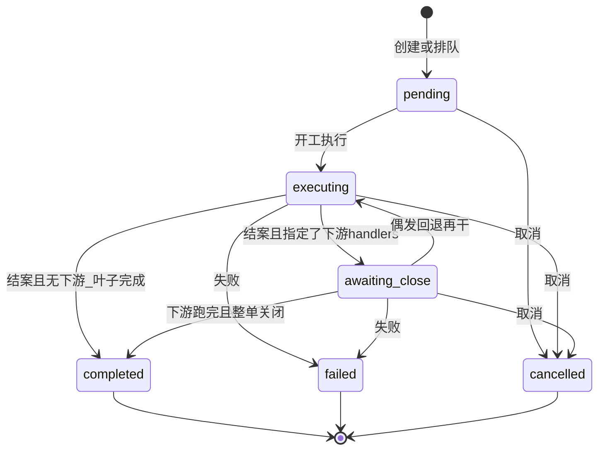
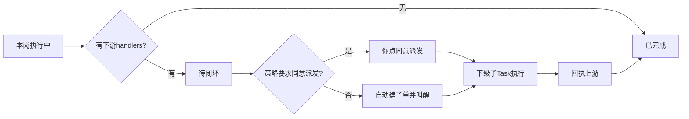
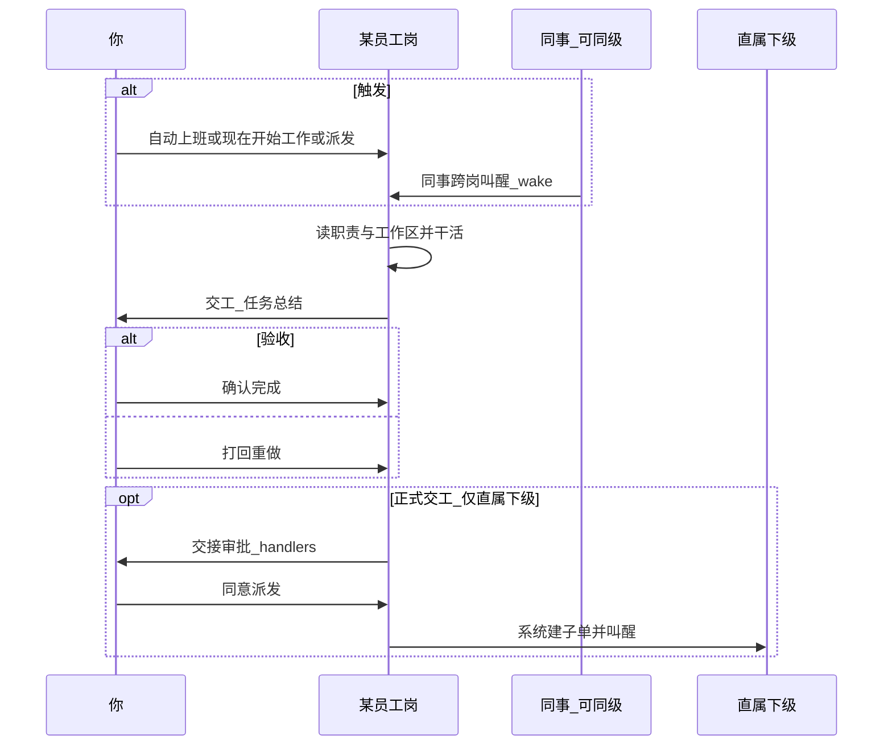
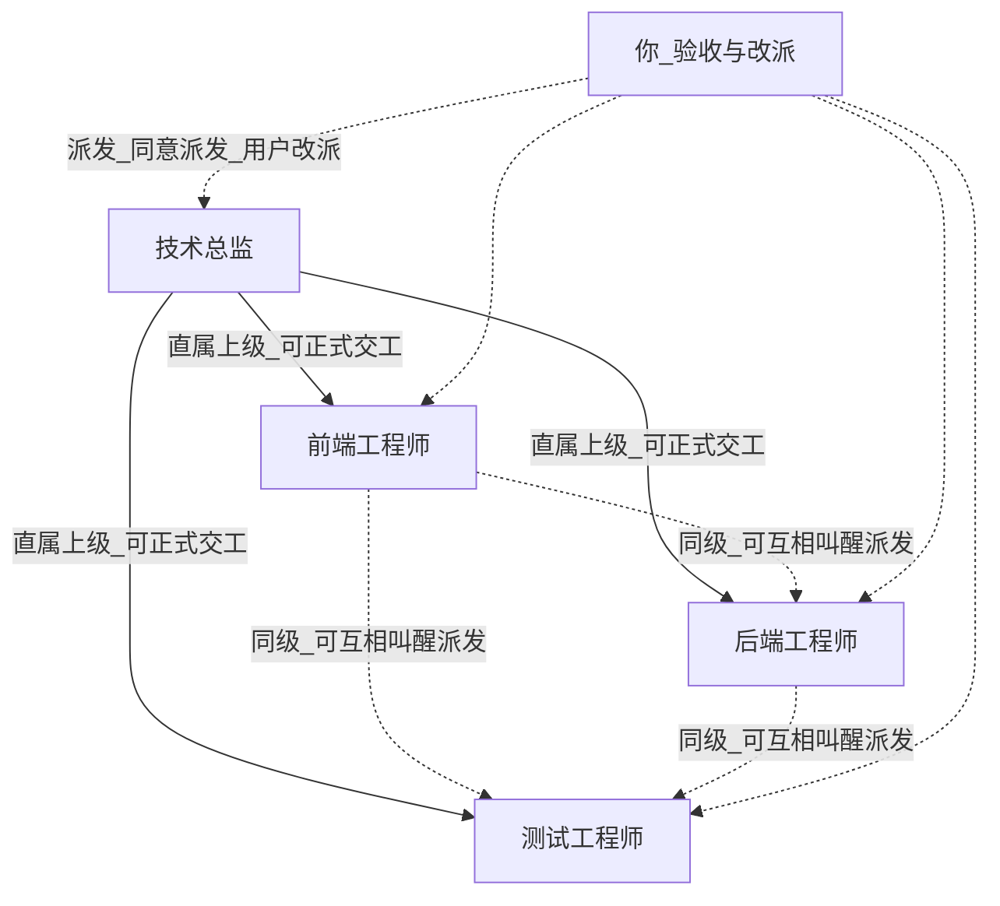
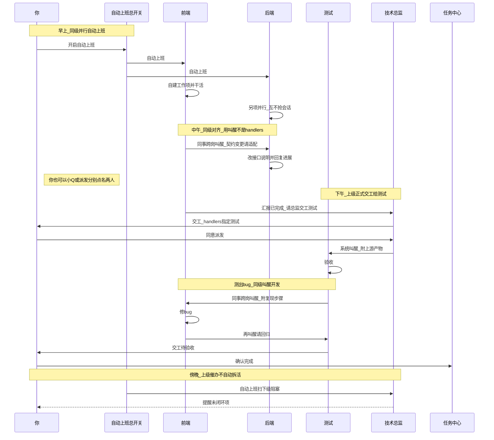
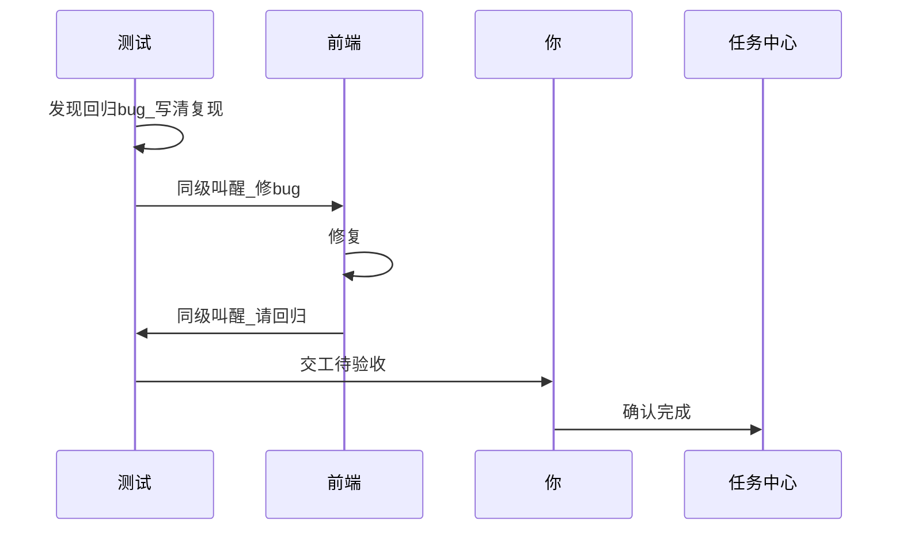

# 智能体员工是什么

> **一句话**：智能体员工 = 把已有「智能体」编成**岗位合同**——规定职责、工作文件夹、上班频率与审批策略，让它在上班时间主动干活、建项、写工作汇报，而不是等你每句点名。
>
> 操作步骤见 [智能体员工指南](../guides/configuration/smart-employees.md) [[guides/configuration/smart-employees|智能体员工指南]] 与 [雇佣第一个员工](../tutorials/hire-first-smart-employee.md) [[tutorials/hire-first-smart-employee|雇佣第一个员工]]。本文按**当前实现**讲怎么流转、多岗怎么协作。

---

## 能干嘛（你雇它是为了什么）

| 类型 | 例子 | 你平时干什么 |
|------|------|--------------|
| **定时盯盘** | 服务健康、仓库脏文件、文档是否过期 | 开值班，看待批 / 工作汇报 |
| **周期交付** | 每周报表、定期审查意见 | 到点收任务总结，确认或打回 |
| **岗位流水线** | 上级交工给直属下级（实现 → 测试等） | 处理「同意派发」，任务中心看整链 |
| **跨岗叫醒** | 同级前端叫醒后端对齐契约；小Q / 你点名某岗 | 派发或让员工 wake 同事 |
| **临时委派** | 今天让运营岗出对外说明 | 小Q 选员工发目标 |
| **催办与前台** | 系统前台盯全局待办 | 少改职责，当协调岗用 |

**不太适合**：一次性深度探索（聊天 / Plan）、流程已定只换参数（应用中心）、到点跑同一句 Prompt（自动化）。

**谁适合用、各行各业怎么组队协作（带组织树与一天故事）** → 单独成文：[智能体员工：谁在用、组织怎么配、怎么协作](../cases/smart-employee-playbooks.md) [[cases/smart-employee-playbooks|智能体员工：谁在用、组织怎么配、怎么协作]]。

---

## 员工是人：身份、记忆与成长

产品叙事上，每个智能体员工应被当作**连续存在的人**，而不是「挂了 SOUL 文案的工具」：

| 层面 | 你感知到什么 | 说明 |
|------|--------------|------|
| **身份** | 换岗也不改的本性与硬边界 | 岗位是合同 / 面具；人可以换岗 |
| **记忆** | 记得用户与项目，也记得**自己做过什么、学到什么** | 与「只记用户偏好」的记忆互补 |
| **风格与成长** | 沟通风格可慢慢贴近你，且有据可查 | 有界漂移 + 变更记录，不是偷偷改人设 |
| **上班节律** | 上班干活；收工写日记 / Lessons；重要收工触发反思巩固 | 不替代值班与 Task 账本 |

当前实现仍以**岗位合同 + SOUL 注入 + 用户/工作区记忆**为主；人格层会按产品节奏逐步补齐。

---

## 两条协作通道（先分清）

实现里跨岗有两套机制，**不要混成一句「同级不能唤醒」**：

| 通道 | 产品说法 | 谁可以叫谁 | 典型入口 |
|------|----------|------------|----------|
| **正式交工** | 结案时指定下游处理人 → 可能「交接审批」→ **同意派发** | 员工只能派给 **直属下级**（对方的「直属上级」是自己）；不能跳级、不能派同级 | 交工填 handlers；系统建子 Task 再 wake |
| **叫醒 / 派发** | 同事跨岗派发、小Q 催办派发、用户派发 | **任意在岗（active）同事**，含同级；不校验汇报线 | 员工页「派发任务」、小Q 委派、主聊天相关派发、同事 wake、事件触发 |

硬规则（交工校验）：

- 同组织（通常同一管辖工作空间）  
- 禁止派给自己  
- 员工派 handlers：**仅直属下级**；越级到孙级会拒绝（须逐级）  
- **你（用户）**在确认页改派时，可指定同组织任意同事（含同级）

所以：

- 「同级能不能唤醒？」→ **能**，走 **派发 / wake**。  
- 「同级能不能当正式交工下游？」→ **不能**（员工侧）；要流水线请把汇报线配成上下级，或由你改派。

组织树 **不会**自动给下级派活；只决定「正式交工合法目标是谁」，并注入值班提示词。

---

## 入口：什么会让员工开始干活

| 入口 | 你在哪点 | 发生什么 |
|------|----------|----------|
| **自动上班已开启** + 上班频率 | `#/proactive` 自动上班总开关 | 到点**自动**上班（须在上班时间内；窗外一般不自动） |
| **现在开始工作** | 员工卡片 ⋯ / 工作日志 | 立刻跑一轮；可勾选聚焦某事项；**不受上班时间限制** |
| **派发任务** | 员工卡片 ⋯ | 你写目标/说明/优先级 → 该岗被叫醒专干这件事 |
| **小Q 委派** | 小Q → 对话 → 选员工 | 一员工一会话下目标（来源记为小Q 催办派发） |
| **主聊天相关派发** | 聊天里对员工下任务（若产品支持） | 来源记为聊天派发 |
| **同事跨岗叫醒** | 另一岗在值班里 wake 你 | 任意在岗同事，含同级；面板可见「同事跨岗派发 · 某某」 |
| **正式交工过门** | 上游结案 + handlers，你点同意派发（或自动） | 系统**建子 Task** 并 wake **直属下级** |
| **下游回执** | 子单终态 | 可 soft-wake 上游做验收/收束 |
| **事件触发** | 若已配置（如仓库事件） | 自动派发到岗 |

前提：全局值班通常要开着；单岗不能是请假/草稿/归档。交工正挂「交接待审批」时，**批准前禁止再 wake 该下游**，避免抢跑。

---

## 任务状态怎么转（员工 Task）

员工干活的主账本是 **Task**（任务中心「智能体员工」来源也能看到）。和用户相关的状态：



| 状态（代码） | 面板常见说法 | 含义 |
|--------------|--------------|------|
| `pending` / `idle` 等 | 待开始 | 已建、尚未认真开跑 |
| `executing` / `in_progress` | 执行中 | 本岗正在干 |
| `awaiting_close` | **待闭环** | **本岗已交工**（进度可到 100%），整单还等下游/验收；任务中心常归在「执行中」提示里 |
| `completed`（含旧 `reviewed`） | 已完成 | 整单终态成功 |
| `failed` | 失败 | 出错，可看原因再派/重试 |
| `cancelled` | 已取消 | 取消 |

要点：

- 结案时若带 **handlers（下游）**，系统会把 `completed` **改写成 `awaiting_close`（待闭环）**，不是整单立刻结束。  
- 无下游的叶子结案 → 直接 **已完成**。  
- 旧文案「待确认 / reviewed」写入时会映射成 **已完成**；员工详情里交工后人闸优先叫 **交接审批 / 同意派发**，不要和「开工前同意」混用。

---

## 下游怎么触发（有哪些形式）

| 形式 | 谁触发 | 对象限制 | 要不要你审核 |
|------|--------|----------|--------------|
| **A. 正式交工 handlers** | 员工结案时指定处理人 | **仅直属下级**（用户可改派同级） | 见下一节「何时审核」 |
| **B. 同事 wake / 跨岗派发** | 员工在轮次里叫醒同事 | **任意在岗**，含同级 | 一般不走交接审批门；对方直接被派一轮 |
| **C. 你派发 / 小Q** | 人 | 任意在岗 | 你自己就是调度，无「同意派发」 |
| **D. 系统过门后自动 wake** | A 通过后 | 子 Task 的 assignee | A 已审过或策略允许自动 |
| **E. 子单回执 soft-wake** | 子单完成/失败等 | 上游岗 | 用于收束，不是新交工链 |

正式交工（A）成功后系统会：校验组织 →（可选）挂审批 → **每个 handler 建一条子 Task** → `employees.wake` 叫醒下级；子单带 `parent_task_id`，详情可见上游产物。

---

## 干完以后怎么处理、什么时候要你审核

### 1. 本岗结案时（员工侧）

员工应写出：

- **任务总结**（做了什么、交付了什么、如何验收）  
- **产出**（文件/链接等，常落在工作区）  
- 可选：**handlers**（下游是谁、读哪些产物、交代什么）

然后：

| 情况 | 系统行为 | 你要做什么 |
|------|----------|------------|
| 无下游 | 状态 → **已完成** | 可在任务中心/工作项看总结；需要时可打回（视入口） |
| 有下游 + 策略判定**要批** | 状态 → **待闭环**；`handlers_pending_approval`；待审批出现 **交接审批** | 点 **同意派发** 或驳回 |
| 有下游 + 策略判定**自动** | 待闭环 → 立刻建子单并叫醒下级 | 通常不用点同意派发；去看下游进度 |
| 下游指了同级/越级 | 交工校验失败 | 改汇报线、改用叫醒，或你改派 |

### 2. 「何时审核」——两道人闸不要混

| 闸 | 按钮文案 | 何时出现 | 控什么 |
|----|----------|----------|--------|
| **交接审批**（主路径） | **同意派发** | 结案+handlers 且 `交接审批策略 × 任务风险` 达到阈值 | 放不放行 **叫醒下一岗** |
| **事项同意**（少见/遗留） | **同意** | 个别需批事项或旧 initiative | 放行某事项执行 |
| **你的验收** | **确认完成** / **打回重做** | 交工待验收、任务中心待确认等 | 人认不认结果；**不等于**同意派发 |

**同意派发阈值**（交工岗的策略 × 该 Task 风险）：

| 交接审批策略 | 大致何时要你点同意派发 |
|--------------|------------------------|
| 谨慎型 | 几乎所有带下游的交工 |
| 平衡型 | 中风险及以上 |
| 全自动 | 仅极高风险 |

新开工作项：**默认直接执行**；人闸重点在「交工后叫醒下一岗」，不是每条任务开工前都审一遍。

### 3. 下游跑完之后

- 子单完成/失败 → 可 **回执 soft-wake** 上游。  
- 整链都结束后，根单从 **待闭环** → **已完成**（或你在任务中心确认）。  
- 测出 bug：同级用 **叫醒** 回流；只有汇报线是上下级时，才适合再用正式交工+同意派发打回去。



---

## 单个员工怎么工作

```text
开启自动上班 + 该岗上班中
    → 自动上班 / 现在开始工作 / 你或小Q派发 / 同事wake / 正式交工被叫醒
        → 岗位会话 proactive:{agent_code}
            → 看职责与工作区 → 建项、干活
            → 本轮小结；结案可写任务总结
                → 你验收（确认完成 / 打回）
                → 若指定直属下级为下游 →（按策略）同意派发 → 系统叫醒下级
```

要点：

1. 每人独立会话，不共享一个聊天大脑。  
2. 「会什么」在智能体页；员工页管何时干、盯哪、审批策略。  
3. 新工作项默认可直接跑；人闸更常卡在 **交工后叫醒下一岗**（同意派发），而不是每件事开工前都批（遗留 initiative 路径除外）。  
4. 产出常在 `docs/roles/<agent_code>/…`，交工带 **任务总结**。

### 单岗一轮（时序）



---

## 整套体系举例：上下级交工 + 同级叫醒

编制要和规则一致。下面这棵树里：**总监可正式交工给三人**；前端 / 后端 / 测试互为**同级**，彼此用 **叫醒/派发**，不能互相当 handlers 下游。

### 编制关系



| 岗位 | 直属上级 | 正式交工能派给谁 | 同级协作怎么走 |
|------|----------|------------------|----------------|
| 技术总监 | — | 前端 / 后端 / 测试 | — |
| 前端 | 总监 | 无直属下级则不能 handlers 交工 | wake / 派发叫醒后端、测试 |
| 后端 | 总监 | 同上 | wake 前端、测试 |
| 测试 | 总监 | 同上 | wake 开发修 bug；或你改派 |

若你希望「前端结案 → 正式交工 → 测试」自动挂子单，需要把测试的 **直属上级改成前端**（或加中间组长），而不是三人全挂在总监下还指望 handlers。

### 一天怎么转（时序）



### 测出 bug 怎么回流

同级树上，测试 **不能** 用正式交工把 handlers 指回前端；常见三种：

1. **测试 wake / 派发叫醒前端**（同事跨岗）——推荐、符合同级规则  
2. **你打回**前端那条，或你派发「修 bug」  
3. **你改派**正式下游（用户覆盖组织限制）



若组织改成「测试的直属上级 = 前端」，才可以用 **同意派发** 做测试↔前端的正式交工链。

### 上午 / 中午 / 下午（文字）

1. **上午**：前后端各自自动上班，并行干活。  
2. **中午对齐**：前端 **叫醒** 后端（或你分别派发）——**不要**写成「同级不能唤醒」。  
3. **下午交付测试**：由 **总监正式交工** 给测试并经你同意派发；或你直接派发/改派测试。  
4. **bug**：测试 **叫醒** 前端修复 → 前端再叫醒测试回归 → 你确认完成。  
5. **傍晚**：总监按催办职责扫阻塞；仍不自动拆活给下级。

### 你这一天常点的按钮

| 时刻 | 动作 |
|------|------|
| 早 | 开值班；必要时同意本岗事项 |
| 中 | 派发 / 小Q 委派；或看着员工互相叫醒 |
| 午后 | 总监交工测试时点 **同意派发** |
| bug | 看总结；需要时派发或打回 |
| 晚 | 任务中心确认完成 |

### 三种关系对照

| 关系 | 例子 | 能做什么 | 不能指望什么 |
|------|------|----------|--------------|
| **上下级** | 总监 → 前端/后端/测试 | 正式交工 handlers + 同意派发 | 上级一开口下级自动开工 |
| **同级** | 前端 ↔ 后端 ↔ 测试 | **互相叫醒/派发**、并行上班 | 互相当正式交工下游 |
| **你** | 调度与验收 | 任意派发、改派、打回、确认 | — |

---

## 谁会叫醒一个岗（来源）

| 来源 | 说明 |
|------|------|
| 自动上班 / 现在开始工作 | 值班节奏或手动开工一轮 |
| 你派发 | 员工页「派发任务」、相关聊天入口 |
| 小Q 委派 | 一员工一会话下目标 |
| 同事跨岗 | `wake` / 交工通过后的系统叫醒；UI 可见「同事跨岗派发」 |
| 正式交工过门 | 同意派发（或低风险自动）后系统建子单并 wake 直属下级 |
| 事件 | 如 git 推送等触发派发（若已配置） |

交工挂「交接待审批」时：批准前 **禁止** 再 wake 该下游，避免抢跑。

---

## 交接审批策略在控什么

**交接审批策略**（全自动 / 平衡型 / 谨慎型）× 该 Task **风险等级** → 决定正式交工后要不要先问你再叫醒下级。

- 谨慎型：几乎都要「同意派发」  
- 平衡型：中风险及以上要批  
- 全自动：仅极高风险要批  

它 **不管** 同级 wake 是否允许（wake 本身不走这道 handlers 门）。

---

## 和相邻能力怎么划界

| 能力 | 适合 |
|------|------|
| 聊天 / Plan | 一次性复杂交付 |
| 任务中心 | 看员工 Task 链与验收 |
| 应用中心 | 固定流程填参再跑 |
| 自动化 | 到点固定 Prompt |
| 智能体员工 | 编内岗位、交工链、同级叫醒、委派 |

---

## 失败时先查哪一层

1. 自动上班总开关 / 请假 / 上班时间  
2. 待审批 / 交接审批（同意派发是否卡住）  
3. 交工失败是否因为 **指了同级当 handlers**（应改汇报线、改用叫醒，或你改派）  
4. 工作过程 / 卡住执行 / 近期没干活  
5. 再改职责或 SOUL  

---

## 相关阅读

- [[guides/configuration/smart-employees|智能体员工（操作指南）]] — 配置与操作
- [[tutorials/hire-first-smart-employee|雇佣第一个智能体员工]] — 10 分钟上手
- [[cases/smart-employee-playbooks|谁在用、组织怎么配、怎么协作]] — 落地画像
- [[guides/tasks/task-center|任务中心]] — 跨来源任务驾驶舱
- [[guides/configuration/agent-management|智能体管理]] — 角色配置
- [[cases/index|最佳实践案例]] — 真实场景
