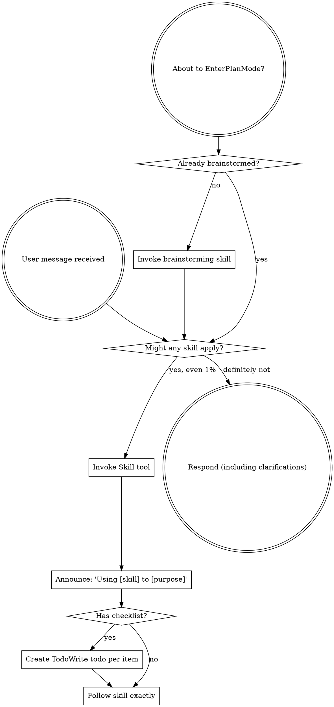

<SUBAGENT-STOP>
If you were dispatched as a subagent to execute a specific task, skip this skill.
</SUBAGENT-STOP>

## QAgent integration (read first)

These skills are **Superpowers-derived** (MIT upstream), adapted for QAgent:

- **Skill IDs** in QAgent use the `superpowers-*` prefix (e.g. `superpowers-subagent-driven-development`). This maps from the Claude plugin namespace `superpowers:*` by replacing `:` with `-`.
- **Structured artifacts**: write specs, plans, and execution notes under `docs/user/evoflow/runs/<run-id>/` so downstream automation, Supervisor replays, and later turns share one source of truth. Replace `<run-id>` with your task id, `thread_id`, or a dated slug. See `docs/user/evoflow/artifacts/README.md` in this repo.
- **Precedence**: QAgent product rules win—Supervisor / Plan–Execute gates / `CLAUDE.md` / `AGENTS.md` override default skill behavior when they conflict.

## 中文摘要

- 技能名均为 `superpowers-*` 前缀；与上游 `superpowers:` 命名对应为把冒号换成连字符。
- 各阶段产出请落到 `docs/user/evoflow/runs/<run-id>/`，便于任务产品化与多轮引用；详见 `docs/user/evoflow/artifacts/README.md`。
- 与 QAgent 全局配置冲突时，以产品侧与用户显式指令为准。

<EXTREMELY-IMPORTANT>
If you think there is even a 1% chance a skill might apply to what you are doing, you ABSOLUTELY MUST invoke the skill.

IF A SKILL APPLIES TO YOUR TASK, YOU DO NOT HAVE A CHOICE. YOU MUST USE IT.

This is not negotiable. This is not optional. You cannot rationalize your way out of this.
</EXTREMELY-IMPORTANT>

## Instruction Priority

`superpowers-*` skills (Superpowers-derived) override default system prompt behavior, but **user instructions always take precedence**:

1. **User's explicit instructions** (CLAUDE.md, GEMINI.md, AGENTS.md, direct requests) — highest priority
2. **QAgent product configuration** (Supervisor, Plan/Execute gates, channel policies) — when applicable
3. **`superpowers-*` skills** — override default system behavior where they conflict with the default prompt only
4. **Default system prompt** — lowest priority

If CLAUDE.md, GEMINI.md, or AGENTS.md says "don't use TDD" and a skill says "always use TDD," follow the user's instructions. The user is in control.

## How to Access Skills

**In Claude Code:** Use the `Skill` tool. When you invoke a skill, its content is loaded and presented to you—follow it directly. Never use the Read tool on skill files.

**In Copilot CLI:** Use the `skill` tool. Skills are auto-discovered from installed plugins. The `skill` tool works the same as Claude Code's `Skill` tool.

**In Gemini CLI:** Skills activate via the `activate_skill` tool. Gemini loads skill metadata at session start and activates the full content on demand.

**In other environments:** Check your platform's documentation for how skills are loaded.

**In QAgent / QAgent:** Skills are discovered from `skills/{public,custom}/` and injected into the agent system prompt when enabled. Use the Gateway skills API or desktop skill toggles to enable/disable. If your harness has no `Skill` tool, treat each `superpowers-*` block as a procedure to follow manually.

## Platform Adaptation

Skills use Claude Code tool names. Non-CC platforms: see `references/copilot-tools.md` (Copilot CLI) for tool equivalents. Gemini CLI users get the tool mapping loaded automatically via GEMINI.md.

# Using Skills

## The Rule

**Invoke relevant or requested skills BEFORE any response or action.** Even a 1% chance a skill might apply means that you should invoke the skill to check. If an invoked skill turns out to be wrong for the situation, you don't need to use it.

## Red Flags

These thoughts mean STOP—you're rationalizing:

| Thought | Reality |
|---------|---------|
| "This is just a simple question" | Questions are tasks. Check for skills. |
| "I need more context first" | Skill check comes BEFORE clarifying questions. |
| "Let me explore the codebase first" | Skills tell you HOW to explore. Check first. |
| "I can check git/files quickly" | Files lack conversation context. Check for skills. |
| "Let me gather information first" | Skills tell you HOW to gather information. |
| "This doesn't need a formal skill" | If a skill exists, use it. |
| "I remember this skill" | Skills evolve. Read current version. |
| "This doesn't count as a task" | Action = task. Check for skills. |
| "The skill is overkill" | Simple things become complex. Use it. |
| "I'll just do this one thing first" | Check BEFORE doing anything. |
| "This feels productive" | Undisciplined action wastes time. Skills prevent this. |
| "I know what that means" | Knowing the concept ≠ using the skill. Invoke it. |

## Skill Priority

When multiple skills could apply, use this order:

1. **Process skills first** (brainstorming, debugging) - these determine HOW to approach the task
2. **Implementation skills second** (frontend-design, mcp-builder) - these guide execution

"Let's build X" → brainstorming first, then implementation skills.
"Fix this bug" → debugging first, then domain-specific skills.

## Skill Types

**Rigid** (TDD, debugging): Follow exactly. Don't adapt away discipline.

**Flexible** (patterns): Adapt principles to context.

The skill itself tells you which.

## User Instructions

Instructions say WHAT, not HOW. "Add X" or "Fix Y" doesn't mean skip workflows.
